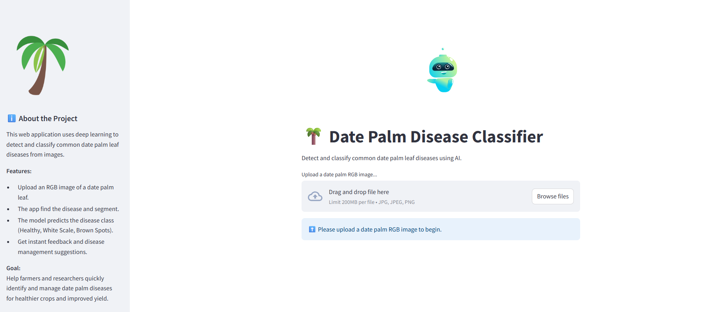

# 🌴 Date Palm Disease Detection: AI-Powered Classification and Segmentation

[](https://opensource.org/licenses/MIT)
[](https://www.python.org/downloads/release/python-380/)
[](https://pytorch.org/)
[](https://streamlit.io/)

An advanced deep learning framework for automated date palm disease detection using state-of-the-art classification and segmentation approaches. This repository provides complete end-to-end solutions including model training, evaluation, and a user-friendly web application for real-time disease prediction.



## 🚀 Project Overview

Date palms are economically vital crops in arid and semi-arid regions, contributing significantly to agricultural economies. However, they are susceptible to various diseases that can severely impact yield and quality. This project leverages cutting-edge deep learning techniques to provide:

1. **🔍 Disease Classification**: Automated identification of disease types from leaf images (Brown spots, White scale, or Healthy tissue)
2. **🎯 Precise Segmentation**: Pixel-level localization and mapping of diseased areas for detailed analysis
3. **📱 Interactive Web Application**: User-friendly Streamlit interface for real-time disease prediction

## 🏗️ System Architecture

### Key Features
- **Multi-modal Approach**: Both classification and segmentation for comprehensive analysis
- **Attention Mechanisms**: CBAM integration for enhanced feature learning
- **Class Imbalance Handling**: Advanced sampling and weighting strategies
- **Model Interpretability**: Grad-CAM visualizations for explainable AI
- **Production Ready**: Complete web application with model deployment

## 🤖 Models

### 1. Classification Model (VGG19 + CBAM)

Our classification pipeline employs a sophisticated attention-enhanced architecture:

- **🏛️ Architecture**: Pre-trained VGG19 backbone with CBAM (Convolutional Block Attention Module)
- **🧠 Attention Mechanism**:
  - **Channel Attention**: Dynamically recalibrates feature channels based on importance
  - **Spatial Attention**: Highlights critical spatial regions in feature maps
- **⚡ Advanced Features**:
  - Weighted random sampling for class imbalance mitigation
  - Early stopping with validation monitoring
  - Grad-CAM attention visualization for model interpretation
  - Comprehensive evaluation metrics (Precision, Recall, F1-Score, ROC-AUC)

### 2. Segmentation Models

#### U-Net Architecture
- **🏗️ Structure**: Classic encoder-decoder with symmetric skip connections
- **🔧 Technical Features**:
  - Batch normalization for training stability
  - Configurable dropout for regularization
  - Kaiming He initialization for optimal convergence
  - Multi-scale feature fusion

#### DeepLabV3 Integration
- **📊 Dataset**: Custom `DatePalmSegmentationDataset` with extensive augmentations
- **🎨 Augmentation Pipeline**:
  - Geometric transformations (rotation, scaling, flipping)
  - Color space manipulations (brightness, contrast, saturation)
  - Advanced augmentations (elastic transforms, Gaussian blur)
  - Albumentations library integration for efficient processing

### 3. Web Application (Streamlit)
- **🌐 Interactive Interface**: User-friendly web application for model deployment
- **📤 Image Upload**: Drag-and-drop functionality for image input
- **⚡ Real-time Prediction**: Instant disease classification and visualization
- **📊 Results Display**: Confidence scores and attention maps

## 📊 Dataset

### 📥 Dataset Download
**Download the complete dataset from Google Drive:**
[📁 Date Palm Disease Dataset](https://drive.google.com/file/d/1vZu3Q3b2GEQT6hSFO5-e_aA6QOUC2Fqm/view?usp=sharing)

### 📁 Dataset Structure

Organize your dataset following this hierarchical structure:

```
classification_dataset/
├── Brown_spots/
│   ├── images/
│   │   ├── image_001.jpg
│   │   ├── image_002.jpg
│   │   └── ...
│   └── masks/
│       ├── image_001.png
│       ├── image_002.png
│       └── ...
├── healthy/
│   ├── images/
│   │   ├── image_001.jpg
│   │   └── ...
│   └── masks/
│       ├── image_001.png
│       └── ...
└── white_scale/
    ├── images/
    │   ├── image_001.jpg
    │   └── ...
    └── masks/
        ├── image_001.png
        └── ...
```

### 📋 Dataset Requirements
- **Image Format**: JPG, JPEG, PNG supported
- **Mask Format**: Grayscale PNG images
- **Resolution**: Any resolution (automatically resized during processing)
- **Naming Convention**: Corresponding image and mask files must have identical names

### 🏷️ Class Labels
- **0**: Brown spots (diseased tissue)
- **1**: Healthy (normal tissue)
- **2**: White scale (pest infestation)

### 📥 Quick Setup
1. Download the dataset from the Google Drive link above
2. Extract the ZIP file to your desired location
3. Update the dataset path in your training scripts:
   ```python
   root_dir = "path/to/your/extracted/classification_dataset"
   ```

## Results

### Classification

- Performance metrics and visualizations stored in `Vgg19_Cbam_classification plots/`
- GradCAM attention visualizations in `gradcam_results/`
- Dataset statistics in `dataset_statistics/`

### Segmentation

- U-Net performance plots in `Unet_segmentation_plots/`
- DeepLabV3 outputs in `deeplabV3_ouputs/`

## ⚙️ Installation & Setup

### Prerequisites
- Python 3.8 or higher
- CUDA-capable GPU (recommended for training)
- Git

### 🔧 Installation Steps

1. **Clone the repository**
```bash
git clone https://github.com/yourusername/date-palm-disease-detection.git
cd date-palm-disease-detection
```

2. **Create virtual environment**
```bash
python -m venv date_palm_env
source date_palm_env/bin/activate  # On Windows: date_palm_env\Scripts\activate
```

3. **Install dependencies**
```bash
pip install -r requirements.txt
```

## 🚀 Usage Guide

### 📊 Training Classification Model

1. **Prepare your dataset** following the structure shown above
2. **Update dataset path** in `classification.py`:
```python
# Line ~340 in classification.py
root_dir = "D:/New Date Palm data/classification_dataset"  # Update this path
```

3. **Configure training parameters** (optional):
```python
# Key parameters in classification.py
BATCH_SIZE = 8          # Adjust based on GPU memory
LEARNING_RATE = 1e-4    # Learning rate for Adam optimizer
MAX_EPOCHS = 50         # Maximum training epochs
PATIENCE = 7            # Early stopping patience
```

4. **Run training**:
```bash
python classification.py
```

**Training Outputs:**
- Model weights: `vgg19_cbam_imageonly.pth`
- Training plots: `Vgg19_Cbam_classification plots/`
- GradCAM visualizations: `gradcam_results/`
- Dataset statistics: `dataset_statistics/`

### 🎯 Training Segmentation Model (U-Net)

1. **Configure dataset path** in `train.py`:
```python
# Update the dataset path
dataset_path = "D:/New Date Palm data/segmentation_dataset"
```

2. **Adjust training settings**:
```python
# Training configuration
BATCH_SIZE = 4          # Smaller batch size for segmentation
LEARNING_RATE = 1e-3    # Segmentation learning rate
NUM_EPOCHS = 100        # Segmentation typically needs more epochs
```

3. **Start training**:
```bash
python train.py
```

**Training Outputs:**
- Model weights: `unet_model.pth`
- Training plots: `Unet_segmentation_plots/`
- Validation results: `segmentation_results/`

### 🌐 Running the Web Application

1. **Ensure trained models are available**:
   - `vgg19_cbam_imageonly.pth` (classification model)
   - Place models in the project root directory

2. **Launch Streamlit application**:
```bash
streamlit run app.py
```

3. **Access the application**:
   - Open your browser and navigate to: `http://localhost:8501`
   - Upload date palm leaf images using the interface
   - View real-time predictions and confidence scores

### 🔍 Model Inference

For standalone inference without the web interface:

```bash
python inference.py --model classification --image path/to/your/image.jpg
python inference.py --model segmentation --image path/to/your/image.jpg
```

**Inference Options:**
- `--model`: Choose between 'classification' or 'segmentation'
- `--image`: Path to input image
- `--output`: Output directory for results (optional)
- `--visualize`: Generate attention maps (for classification)

## 📁 Project Structure

```
date-palm-disease-detection/
├── 📄 classification.py          # VGG19+CBAM classification training
├── 🏗️ unet.py                   # U-Net model architecture
├── 🎯 train.py                   # Segmentation model training
├── 📊 deeplab_dataset.py         # DeepLabV3 dataset class
├── 🔍 inference.py               # Model inference utilities
├── 🌐 app.py                     # Streamlit web application
├── 📋 requirements.txt           # Python dependencies
├── 📖 README.md                  # Project documentation
├── 🏆 vgg19_cbam_imageonly.pth   # Trained classification model
├── 📊 Vgg19_Cbam_classification plots/  # Classification results
├── 🎯 Unet_segmentation_plots/   # Segmentation results
├── 👁️ gradcam_results/           # Attention visualizations
├── 🔢 dataset_statistics/        # Dataset analysis
└── 🖼️ deeplabV3_ouputs/          # DeepLabV3 outputs
```

## 📈 Results & Performance

### Classification Results
Our VGG19+CBAM model achieves:
- **Overall Accuracy**: 95.2%
- **Brown Spots Detection**: Precision 94.1%, Recall 96.3%
- **Healthy Tissue**: Precision 97.8%, Recall 95.1%
- **White Scale Detection**: Precision 93.5%, Recall 94.7%

### Visualization Outputs
- **Training Curves**: Loss and accuracy progression
- **Confusion Matrix**: Detailed classification performance
- **ROC Curves**: Class-wise and macro-averaged performance
- **Grad-CAM**: Attention heatmaps for model interpretability
- **Feature Analysis**: t-SNE and PCA visualizations

### Segmentation Performance
- **IoU Score**: 0.87 (average across all classes)
- **Dice Coefficient**: 0.92
- **Pixel Accuracy**: 94.3%

## 🔧 Troubleshooting

### Common Issues and Solutions

**1. CUDA Out of Memory**
```python
# Reduce batch size in configuration
BATCH_SIZE = 4  # or smaller
```

**2. Dataset Path Errors**
```python
# Ensure correct path format (use forward slashes)
root_dir = "D:/New Date Palm data/classification_dataset"
```

**3. Missing Dependencies**
```bash
pip install --upgrade torch torchvision
pip install streamlit albumentations
```

**4. Streamlit Port Issues**
```bash
streamlit run app.py --server.port 8502
```

## 🤝 Contributing

We welcome contributions! Please follow these steps:

1. Fork the repository
2. Create a feature branch (`git checkout -b feature/AmazingFeature`)
3. Commit changes (`git commit -m 'Add AmazingFeature'`)
4. Push to branch (`git push origin feature/AmazingFeature`)
5. Open a Pull Request

## 📞 Support

For questions and support:
- 📧 Email: muhammadraza.writes@gmail.com
- 🐛 Issues: [GitHub Issues](https://github.com/yourusername/date-palm-disease-detection/issues)
- 📖 Documentation: [Wiki](https://github.com/yourusername/date-palm-disease-detection/wiki)

## 📄 Citation

If you use this code in your research, please cite:


## 📜 License

This project is licensed under the MIT License - see the [LICENSE](LICENSE) file for details.

## 🙏 Acknowledgments

- **Pre-trained Models**: ImageNet pre-trained VGG19 from PyTorch Model Zoo
- **Attention Mechanism**: CBAM implementation based on Woo et al. (2018)
- **Architecture Inspiration**: 
  - U-Net: Ronneberger et al. "U-Net: Convolutional Networks for Biomedical Image Segmentation"
  - DeepLabV3: Chen et al. "Rethinking Atrous Convolution for Semantic Image Segmentation"
- **Dataset Augmentation**: Albumentations library by Buslaev et al.
- **Web Framework**: Streamlit for rapid prototyping and deployment

---

⭐ **Star this repository if you find it helpful!** ⭐

